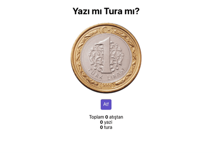

## Yazı Tura

Yalnızca bir madeni paraya ihtiyaç duyulan, oldukça kolay oynanabilecek ve dünyanın hemen her yerinde yaygın olan yazı tura oyununu React ile yapalım.

### [Demo](https://random-yazi-tura.vercel.app/)

### Proje Nasıl Çalıştırılır

- Projeyi fork'ladıktan ya da indirdikten sonra projenin bulunduğu klasörde "npm install" komutu ile gerekli paketlerin yüklenmesi gerekiyor.
- Daha sonra "npm run start" komutu ile uygulama başlatılabilir.

### Proje Hakkında

App.js'de görüldüğü üzere CoinFlipper adlı bir component render ediyoruz. Bu component'in state'i içerisinde "side" ve "flipping" olarak 2 farklı bilgi tutuyoruz. Tutulan bu bilgiler Coin adında farklı bir component'e prop olarak geçiliyor ve Coin component'i içerisinde bu prop'a göre paranın hangi yüzü geleceğine karar verilip render ediliyor.

#### Todos

- [ ] Yazı ve Tura sayıları canlı hale getirilecek.